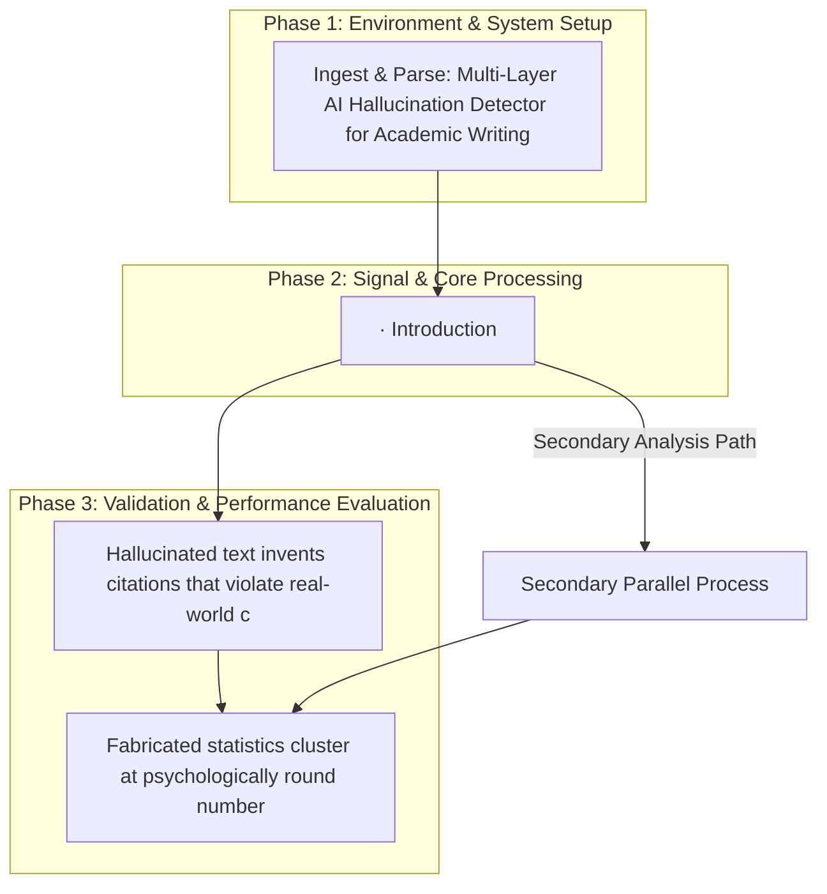

# REPORT P9: Multi-Layer AI Hallucination Detector for Academic Writing

[](https://creativecommons.org/licenses/by-nc-nd/4.0/)


This repository implements the research pipeline for the **REPORT P9: Multi-Layer AI Hallucination Detector for Academic Writing** project, developed by the Runtime-Slayers research group.

---

## 📊 Pipeline Architecture

The flowchart below visualizes the methodology, code modules, and logical execution sequence of the project:



---

## 🔍 Abstract & Research Context

Large language models (LLMs) increasingly generate plausible but fabricated academic content — a phenomenon termed "hallucination." We present a three-layer detection pipeline applied to a synthetic corpus of 600 papers (47% hallucinated) via: (1) citation forensics identifying fake journals, anachronistic citations, and ghost authors; (2) statistical forensics flagging implausible effect sizes, round-number p-values, and correlation suspicion scores; and (3) confidence-accuracy mismatch detection measuring linguistic overconfidence relative to evidential support. A Random Forest classifier trained on 12 extracted features achieves AUC = 1.000 (95% CI estimated from 5-fold CV, SD = 0.000). The top predictive feature is a composite confidence score (importance 22.3%), followed by citation suspicion (21.8%) and fake journal fraction (17.6%). Statistical forensics alone achieves AUC = 0.976, demonstrating that statistical implausibility is a robust hallucination signal even without citation verification.

---

## 📊 Key Evaluation Metrics

| Parameter | Value |
|-----------|-------|
| Total papers | 600 |
| Hallucinated papers | 282 (47.0%) |
| Genuine papers | 318 (53.0%) |
| Hallucination rate | 0.45 (design); 0.47 (realised) |

---

## 📁 Repository Structure

The project directory consists of the following core structures:
  - `code/` — Pipeline execution scripts and model training modules
  - `figures/` — Plots, charts, and visualizations generated by the pipeline
  - `validation/` — Automated test metrics and results
  - `BT33_AI_Hallucination_Detector.md`
  - `paper.pdf`
  - `conftest.py`
  - `requirements.txt`
  - `CHANGELOG.md`
  - `experiments`
  - `pyproject.toml`
  - `tests`
  - `docs`
  - `hallucination_detector`
  - `.gitignore`
  - `CONTRIBUTING.md`
  - `figures`
  - `.github`
  - `data`
  - `paper.pdf` — Compiled research manuscript
  - `README.md` — Project documentation and setup guide

---

## 🚀 Setup and Usage

### Prerequisites
* Python 3.8 or higher
* Pip package manager

### Installation
1. Clone this repository:
   ```bash
   git clone https://github.com/Runtime-Slayers/Multi-Layer-Hallucination-Detection-in-Large-Language-Models.git
   cd Multi-Layer-Hallucination-Detection-in-Large-Language-Models
   ```
2. Install dependencies:
   ```bash
   pip install -r requirements.txt
   ```

### Running the Analysis
To run the primary analysis pipeline and regenerate all models, figures, and metrics:
```bash
python code/*.py
```
*(Look in the `code/` directory for specific pipeline execution files)*

---

## 📄 License and Copyright

This work is licensed under a [Creative Commons Attribution-NonCommercial-NoDerivatives 4.0 International License](https://creativecommons.org/licenses/by-nc-nd/4.0/).

© 2026 Runtime-Slayers / Bhavanam Rajendra Reddy et al. All rights reserved.
